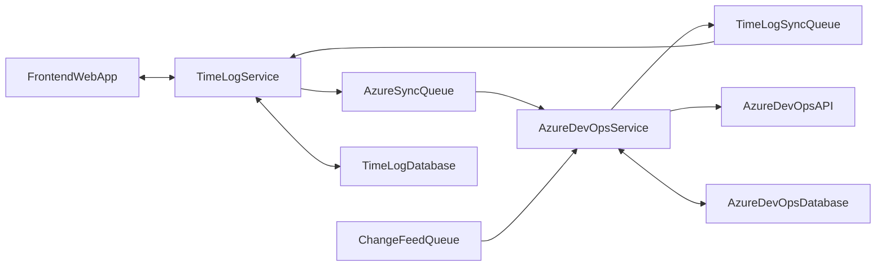

# Aion Time

Aion Time is a complementary app designed to enhance time tracking for Azure Boards work items. It aims to provide seamless integration with Azure Boards, offering advanced time tracking features to improve project management and productivity.

## Features

- **Integration with Azure Boards**: Aion Time seamlessly integrates with Azure Boards, allowing users to track time directly from work items.
- **Time Tracking**: Easily track time spent on individual work items, tasks, or projects.
- **Reporting**: Generate detailed reports on time spent across various work items, enabling better project management and resource allocation.
- **Customization**: Customize time tracking settings and reports to suit your team's specific needs.
- **User-friendly Interface**: Aion Time features a clean and intuitive interface for effortless time tracking and management.

- ## Diagram
  

## Getting Started

To get started with Aion Time, follow these steps:

1. **Installation**: Install Aion Time from the [GitHub releases page](https://github.com/yourusername/aion-time/releases) or build it from the source code.
2. **Configuration**: Configure Aion Time with your Azure Boards account and project settings.
3. **Start Tracking**: Start tracking time for your work items directly within Azure Boards or through the Aion Time interface.
4. **Generate Reports**: Generate reports to gain insights into time spent on different work items and projects.

## Contributing

Contributions are welcome! If you have any ideas, suggestions, or bug reports, feel free to open an issue or submit a pull request on the [GitHub repository](https://github.com/yourusername/aion-time).

## License

This project is licensed under the [MIT License](LICENSE).

## Acknowledgements

- Special thanks to the contributors who have helped improve Aion Time.
- Built with [Azure DevOps API](https://docs.microsoft.com/en-us/rest/api/azure/devops/?view=azure-devops-rest-6.0) and .Net.

---

**Note:** Aion Time is not affiliated with or endorsed by Microsoft Azure or Azure DevOps.

